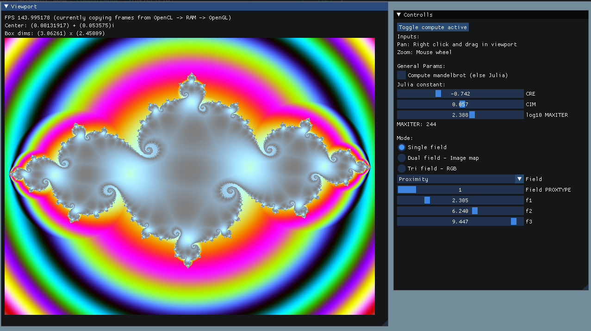
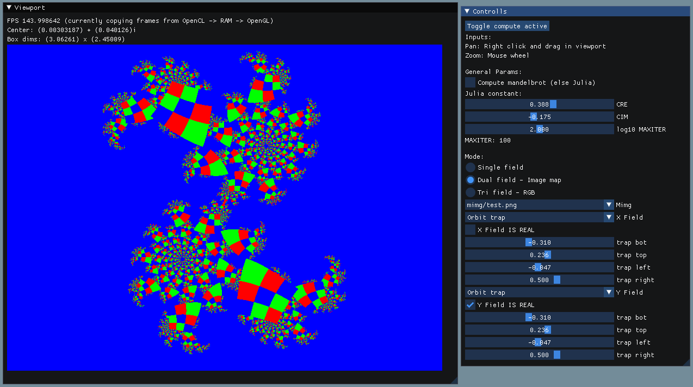

# CLImFractal

Realtime fractal explorer, using GPU compute via OpenCL and a Dear ImGUI interface.

Currently frames are passed from OpenCL -> RAM -> OpenGL, but the idea would be to use GLCL interop to directly write to OpenGL buffers from OpenCL, never leaving the GPU.

The files `mandel.cl`, `mandelstructs.h` and `mandelutils.c` should be kept with the binary, as the OpenCL kernels are compiled at runtime from these.

## Building

The `IMGUI_DIR` and `OPENCL_INCLUDE_PATH` should be updated in the `Makefile`, then simply run `make -j <Ncores>`.

## Todo

* Images seem to load flipped horizontally
* Viewport resolution selection
* Save/load fractal compute settings
* Arbitrary precision?
